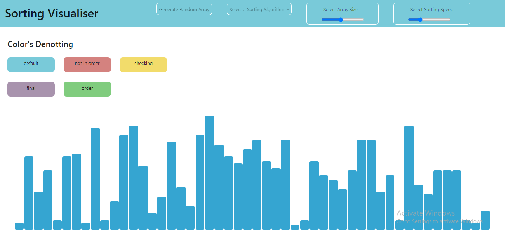

# Sorting Visualizer Tool

Welcome to the Sorting Visualizer Tool repository!

## Overview
This repository hosts a Sorting Visualizer Tool, designed to provide a visual representation of various sorting algorithms. Whether you're a beginner learning about sorting algorithms or an experienced developer looking to visualize their performance, this tool has you covered.

## Features
- **Multiple Sorting Algorithms:** Choose from a variety of popular sorting algorithms, including Bubble Sort, Quick Sort, Merge Sort, Insertion Sort, and more.
- **Customizable Array Size:** Adjust the size of the array to visualize sorting with different data set sizes.
- **Real-Time Visualization:** Watch as the algorithm processes the array in real-time, providing an intuitive understanding of how each algorithm works.
- **Speed Control:** Control the speed of the visualization to observe the sorting process at your preferred pace.
- **Colorful Representation:** Enjoy visually appealing animations that highlight the sorting process step by step.

## Getting Started
To get started with the Sorting Visualizer Tool, simply clone this repository to your local machine and open the `index.html` file in your web browser. No additional setup or dependencies are required.

## Usage
1. Choose a sorting algorithm from the dropdown menu.
2. Adjust the array size using the slider.
3. Click the "Generate Array" button to create a new random array.
4. Click the "Sort" button to visualize the chosen sorting algorithm in action.
5. Sit back and watch as the array gets sorted right before your eyes!

## Contributing
Contributions are welcome! If you'd like to contribute to this project, please fork the repository and submit a pull request with your changes.

## License
This project is licensed under the MIT License - see the [LICENSE](LICENSE) file for details.

## Acknowledgements
- This project was inspired by the desire to provide an interactive learning tool for understanding sorting algorithms.
- Special thanks to [insert contributors' names here] for their contributions to this project.

## Contact
If you have any questions, suggestions, or feedback, feel free to contact us at [insert contact email here]. We'd love to hear from you!

Happy Sorting! 🚀
